# Modern Data Architecture Diagrams

This document contains visual representations of modern data architecture patterns and components using Mermaid diagrams.

## 🏗️ Overall Architecture Overview

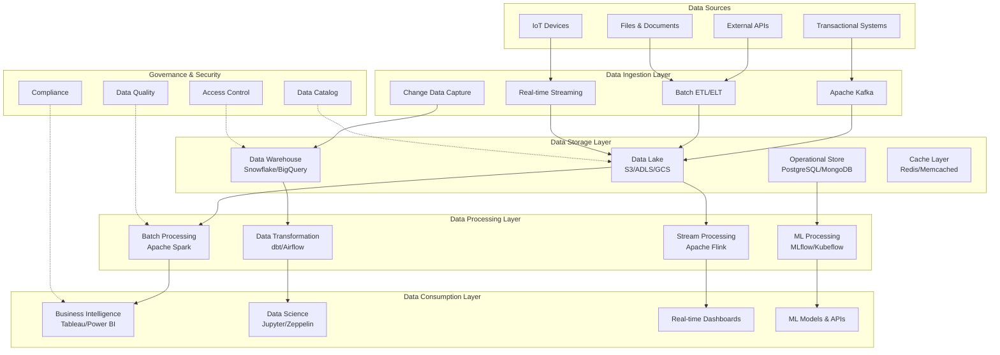

## 🔄 Data Flow Architecture

### Real-Time Data Flow

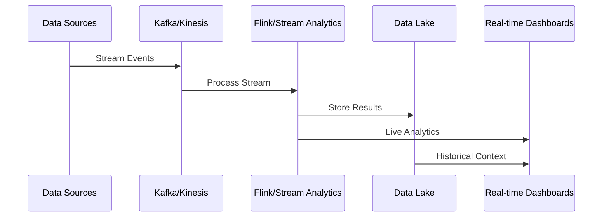

### Batch Data Flow

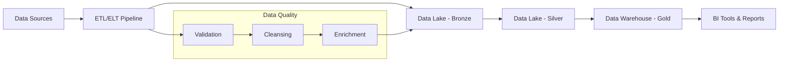

## 🏛️ Data Lakehouse Architecture

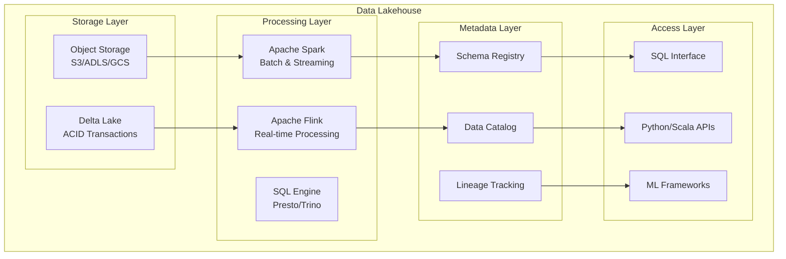

## 🌐 Data Mesh Architecture

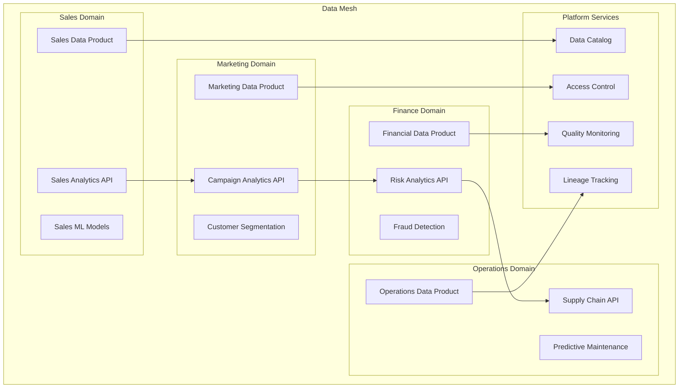

## ⚡ Lambda Architecture

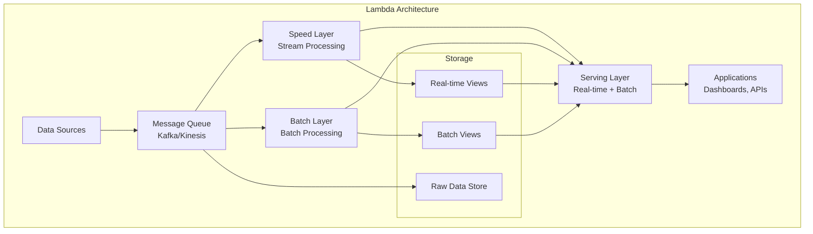

## 🔐 Security and Governance Architecture

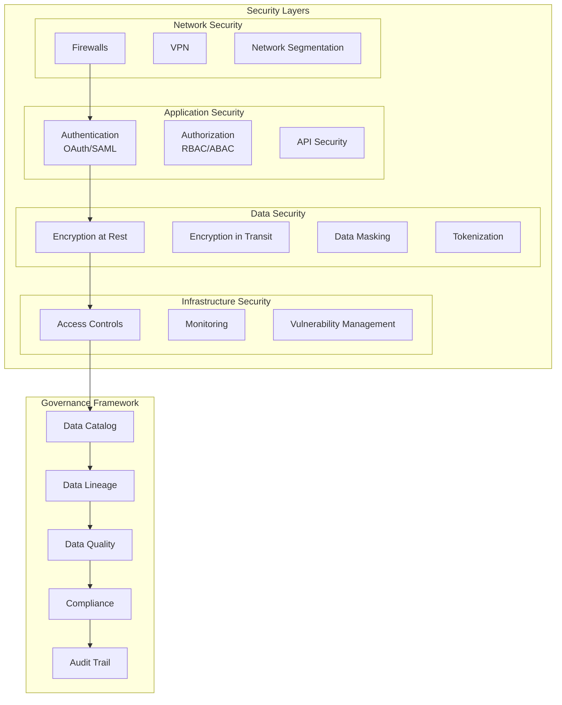

## 📊 Technology Stack Comparison

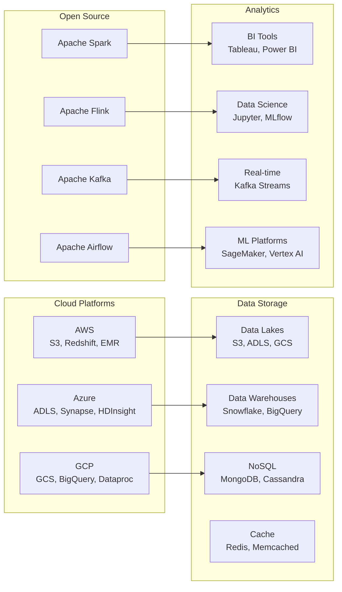

## 🔄 Data Processing Patterns

### ETL vs ELT

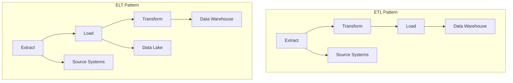

### Stream Processing Architecture

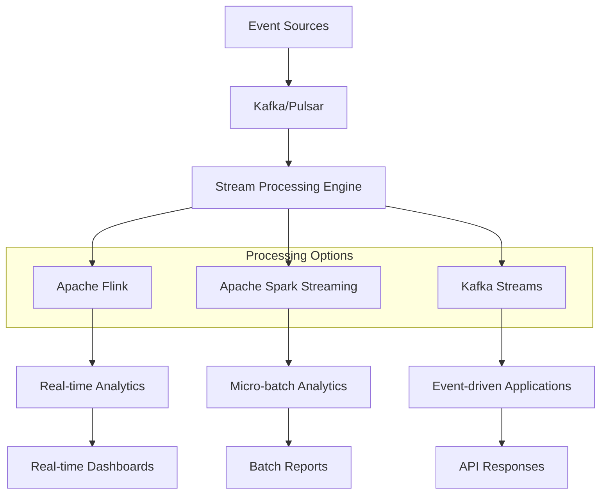

## 📈 Performance and Scalability

### Auto-scaling Architecture

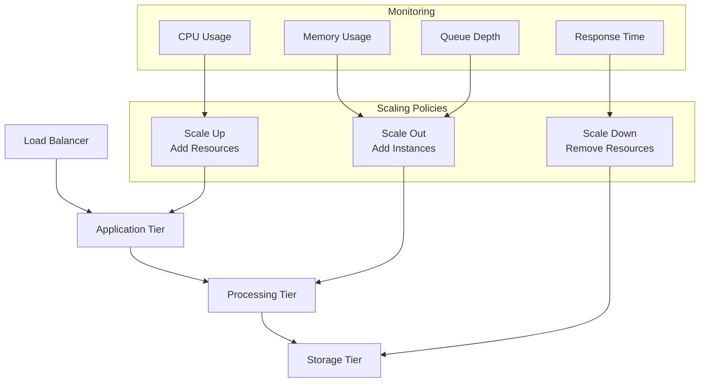

## 🚀 Implementation Phases

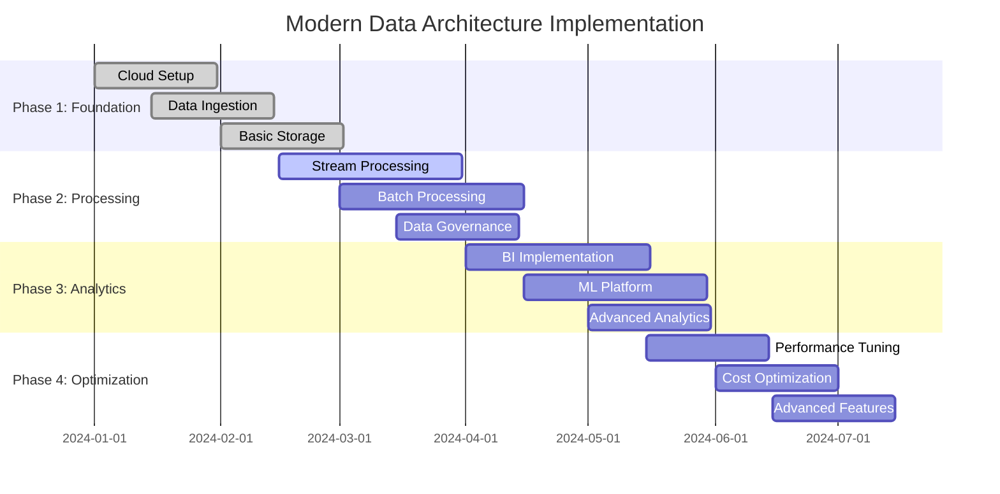

## 🔗 Integration Patterns

### API Gateway Architecture

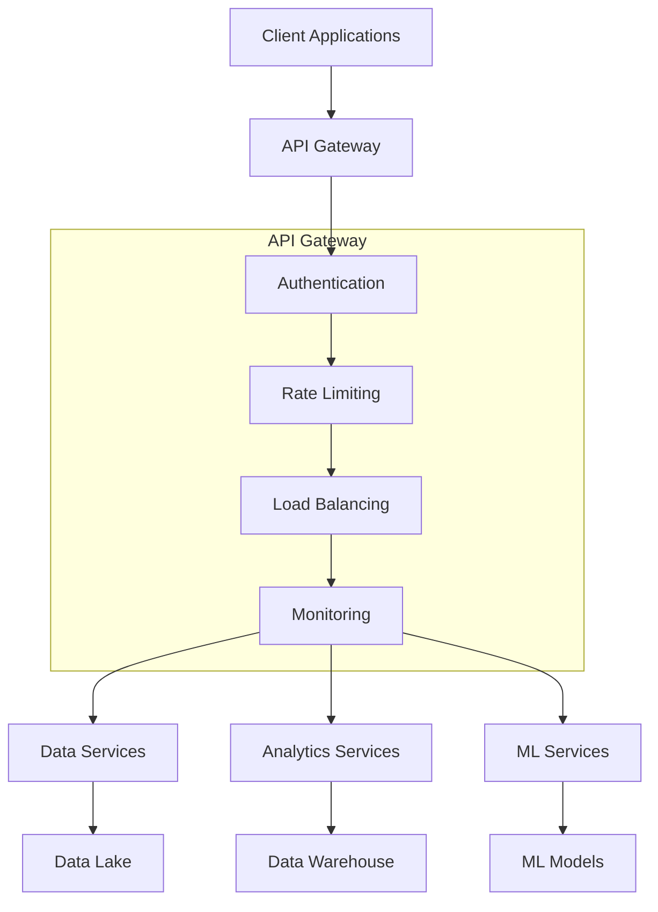

### Event-Driven Integration

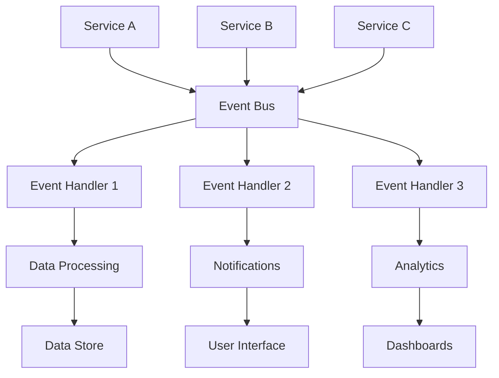

---

*These diagrams provide visual representations of modern data architecture patterns and can be used for presentations, documentation, and architectural discussions.*
